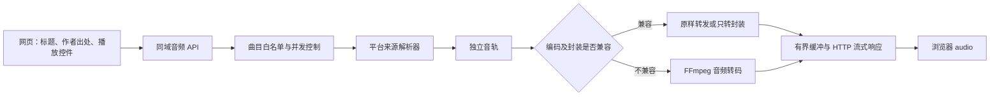

# 个人音乐站：平台歌单与纯音频流式播放技术方案

版本：v1.0  
日期：2026-09-20  
状态：技术设计，尚未实现纯音频后端  
适用项目：`D:/blog-website/blog-website`

## 1. 目标与已确认需求

将网易云音乐和 Bilibili 的歌单内容放入个人网站，在站内通过音频控件播放。

- 音乐页保持现有雨夜背景和玻璃面板；播放器不显示视频画面、不显示曲目封面。
- 播放器显示标题、原作者、来源平台、原内容链接和播放控件。
- 移除本地文件导入，访客不上传音频。
- 支持歌单浏览、标题／作者搜索、收藏、手动切歌；真实播放建立后再支持顺序播放。
- 优先获取独立音轨，默认不保存完整视频或音频文件。
- 本项目按用户说明的“非商用、标注出处”的使用条件设计；这是项目输入条件，并非对全部曲目许可范围的独立核验结果。
- 遵循现有文件约束：不自动删除文件；若未来启用磁盘缓存，清理规则必须另行确认。

“页面不显示封面”针对播放器和曲目卡片，现有整页背景和站点 Logo 可以保留。

## 2. 当前代码实际状态

| 项目 | 当前状态 |
| --- | --- |
| 前端 | Vue 3 + TypeScript + Vite + Vue Router |
| 页面 | 首页、博客、文章详情、音乐均为独立路由 |
| 音乐路由 | `/music` |
| Bilibili 来源 | 用户提供的收藏夹，ID 为 `3549762089`，名称“哈基米” |
| 视频列表 | 2026-09-20 成功同步 53 条元数据；这是快照，不保证以后仍为 53 条 |
| 同步命令 | 在 `frontend` 执行 `pnpm run sync:music` |
| 当前播放方式 | Bilibili 官方 iframe，尚非纯音频 |
| 已知播放限制 | 独立打开官方播放器可显示标题、时长和控件；此前应用内 iframe 空白，未确认站内媒体播放成功 |
| 本地导入 | 已从 MusicView 移除 |
| 标题式播放器 | 用户需求已明确；当前代码仍保留播放器配图，待实施时移除其渲染 |
| 网易云 | 未收到实际歌单链接，真实列表和播放能力均未验证 |
| 纯音频服务 | 未实现，未确认当前机器安装了 yt-dlp／FFmpeg |

现有相关文件：

- `frontend/src/views/MusicView.vue`：音乐页面和平台切换。
- `frontend/src/assets/music.css`：音乐页样式。
- `frontend/src/musicSources.ts`：平台来源类型、配置和 iframe 地址校验。
- `frontend/src/data/bilibili-playlist.json`：收藏夹元数据快照。
- `frontend/scripts/sync-bilibili.mjs`：分页同步公开收藏夹元数据。

当前同步接口是平台网页使用的公开元数据接口，不是稳定性有承诺的开放 API。已有数据同步成功不代表音频流解析一定成功。

用户指定来源：[Bilibili 收藏夹](https://space.bilibili.com/292715089/favlist?fid=3549762089&ftype=create)。

## 3. 推荐架构

建议沿用项目原规划：Vue 前端 + Go/Gin 后端。新增一个音频服务模块，不为了播放单独引入整套微服务系统。以下后端目录与接口均是拟议设计，并非已有代码。



各部分责任：

| 模块 | 责任 |
| --- | --- |
| 歌单同步 | 获取并校验曲目元数据，失败时保留最近一次完整结果 |
| 来源解析器 | 根据已登记的平台 ID 查找可用音轨、格式和必要请求头 |
| 播放服务 | 创建播放会话，处理限流、超时、取消和响应 |
| FFmpeg Worker | 仅在需要转封装或转码时运行 |
| 前端播放器 | 驱动 audio，展示真实状态和出处，按实际能力开放进度拖动 |

推荐第一版部署为单机、单后端实例；先验证一首 Bilibili 视频，再验证完整歌单。网易云作为独立适配器接入，不直接套用 Bilibili 的解析逻辑。

## 4. 音频获取与处理策略

### 4.1 优先获取独立音轨

yt-dlp 可选择 `bestaudio`；当来源没有独立音轨时，不应默默回退到完整高清视频。第一阶段返回明确的不可用状态，是否允许读取含视频的媒体后丢弃画面，作为后续可选策略。[yt-dlp 官方文档](https://github.com/yt-dlp/yt-dlp#format-selection)

解析器应输出内部描述，而非把临时媒体地址直接交给网页：

```text
ResolvedAudio
  provider / trackId / partId
  inputUrl 或下载器输出管道
  httpHeaders（只在后端使用）
  codec / container / durationSeconds
  expiresAt（如果来源能够可靠提供）
  rangeSupported（实测能力）
```

需要同时处理 BVID 和具体分 P／CID。首轮可以只播放 P1，但 UI 和验收必须写明，不将多 P 视频视为单一完整音轨。

### 4.2 选择转发、转封装或转码

| 方式 | 触发条件 | 资源影响 |
| --- | --- | --- |
| 原样转发 | 浏览器支持源编码与封装，HTTP 行为可正确代理 | 通常 CPU 开销最低 |
| stream copy 转封装 | 编码兼容，但容器不适合当前交付方式 | 不重新编码，仍需处理容器和时间戳 |
| 音频转码 | 源格式不兼容，或确需统一输出格式 | 消耗 CPU，可能有有损编码损失 |

FFmpeg 的 `-vn` 排除视频输出；`-c:a copy` 表示复制音频编码数据，并不自动保证输入／输出容器和浏览器都兼容。[FFmpeg 文档](https://ffmpeg.org/ffmpeg.html#Streamcopy)

建议 PoC 首先尝试兼容路径；必要时以 128 kbps MP3 作为兼容性候选，而不是假定必须统一转码。具体输出方案经目标浏览器测试后确定。

### 4.3 无落盘不等于任意格式都能走管道

FFmpeg 支持 `pipe:0` 和 `pipe:1`，但管道不可随机定位。某些 MP4 输入依赖文件尾索引或可 seek 的输入，不能保证直接从 stdin 边收边解码。必要时让 FFmpeg 读取受校验的远程 HTTP 输入；如仍无法满足则返回不可用，而不是临时保存整个文件。[FFmpeg 协议文档](https://ffmpeg.org/ffmpeg-protocols.html#pipe)

若输出 MP4，应选择适于顺序输出的 fragmented MP4 并测试兼容性；不要使用需要完成文件后移动索引的普通文件工作流作为“实时无落盘”方案。[FFmpeg 容器文档](https://ffmpeg.org/ffmpeg-formats.html#mov_002c-mp4_002c-ismv)

## 5. 播放请求生命周期

1. 访客点击曲目，前端提交已登记的 `trackId`，不提交任意媒体 URL。
2. 后端验证曲目、来源状态和并发配额。
3. 解析可用音轨；重复的解析请求可以合并，但不能无限期缓存带时效性的媒体 URL。
4. 建立上游连接，必要时启动 FFmpeg。
5. 等首批有效媒体数据后发送成功响应，缩小“HTTP 200 但实际无内容”的窗口。
6. 按下游消费速度转发，缓冲达到上限时暂停上游读取。
7. 用户切歌、离页、主动停止或网络断开后，取消上游请求并终止相关进程。
8. 正常 EOF 结束响应；异常结束时由前端显示错误并允许重新尝试。

进程管理要求：

- 使用参数数组启动程序，不拼接 shell 命令。
- 持续读取 stdout 与 stderr，避免管道填满导致死锁；stderr 只保留有界诊断信息。
- 请求取消后先正常终止，再在短暂宽限期后强制终止整个子进程树。
- 超时分为解析超时、首字节超时、无数据超时和最大会话时长，不能用一个很短的总超时截断正常长视频。
- 单个媒体响应已开始后不能再发送 JSON 错误体，避免污染音频数据；详细失败原因通过会话状态接口查询。

## 6. 进度条、Range 与断点恢复

第一版能力定义为：播放、暂停、停止、音量、手动切歌，以及真实进度显示；不承诺任意位置拖动。

原始媒体字节没有改写、上游支持 Range 且代理能够正确转发时，才考虑提供 `206 Partial Content`、`Content-Range` 和正确长度。不要为动态转码输出伪造字节偏移或 `Accept-Ranges: bytes`。[HTTP Range 说明](https://developer.mozilla.org/en-US/docs/Web/HTTP/Guides/Range_requests)

动态流建议明确返回 `seekMode: "none"`；前端将进度条作为只读显示。若浏览器发送 Range，服务器可以按 HTTP 规则忽略并返回完整的 200 响应，不把它伪装成范围响应；这一行为需要针对实际 audio 加载流程测试。

后续可增加 `seekMode: "restart"`：

- 提交目标秒数，建立新流；旧流和进程必须取消。
- 前端保存本次起点，显示进度为“起点 + 新流 currentTime”。
- 需要实测来源定位能力、起播延迟和转码时间戳；它不是传统文件的无缝 Range 拖动。

暂停时 audio 仍可能缓冲。若设置“长时间暂停释放会话”，恢复播放必须明确从头开始，或在实现 restart 定位后从已记录位置继续，不可承诺无条件原地恢复。

## 7. 存储、内存与流量估算

估算公式，采用十进制 MB：

```text
大小（MB）≈ 码率（kbps）× 时长（秒）÷ 8 ÷ 1000
```

| 音频码率 | 5 分钟 | 1 小时 |
| --- | ---: | ---: |
| 128 kbps | 4.8 MB | 57.6 MB |
| 192 kbps | 7.2 MB | 86.4 MB |
| 320 kbps | 12 MB | 144 MB |

以上为载荷估算，不含 HTTP/TLS 与容器开销。例如 53 首全部按 5 分钟、192 kbps 假设，约 381.6 MB；这不是当前收藏夹实际体积，实际包含长视频，需要按真实时长统计。

默认策略：

- 持久化歌单元数据，不持久化媒体内容。
- 不启用媒体文件缓存、HLS 磁盘分片或完整视频下载。
- 内存只保存有界数据块；绝不使用整段 `readAll` 后再响应。
- 第一版每个监听者使用独立媒体会话；暂不设计复杂共享转码广播。
- “无落盘”限定为服务不主动写媒体文件，不代表操作系统 swap、浏览器缓存或日志完全不写磁盘。

带宽示例：10 人同时收听 192 kbps 音频，仅下行载荷约 1.92 Mbps、每小时 864 MB。独立上游会话通常还会产生相应入站流量；使用高码率源再转低码率输出时，两者不相等。

建议初始资源参数（设计起点，非性能实测）：

| 参数 | 初始值 |
| --- | --- |
| 全局活跃媒体会话 | 4 |
| 同时转码 Worker | 2 |
| 并发解析任务 | 2 |
| 每会话应用层排队字节上限 | 1 MiB |
| 解析超时 | 20 秒 |
| 首字节超时 | 15 秒 |
| 无数据超时 | 30 秒 |
| 最长播放会话 | 6 小时，可按内容调整 |

1 MiB 只是应用层缓冲上限，不包含下载器、FFmpeg、TLS 与操作系统缓冲。需要记录整棵进程树的内存和 CPU，测量后再调高并发。

## 8. 反向代理与磁盘缓冲

仅后端使用管道还不够。Nginx 在启用响应缓冲时可能写临时文件，因此媒体路由需要关闭响应缓冲和缓存。[Nginx 官方文档](https://nginx.org/en/docs/http/ngx_http_proxy_module.html#proxy_buffering)

以下配置是未来部署示例，不在本次任务中执行。`audio_backend` 需要在真实部署中定义：

```nginx
location /api/v1/music/streams/ {
    proxy_pass http://audio_backend;
    proxy_http_version 1.1;
    proxy_buffering off;
    proxy_cache off;
    proxy_max_temp_file_size 0;
    proxy_read_timeout 60s;
    proxy_send_timeout 60s;
    gzip off;
}
```

60 秒是代理相邻读取等操作的超时设置，不是歌曲总时长。应用层可以返回 `X-Accel-Buffering: no`；如还有 CDN、隧道或其他代理，也要检查它们是否重新缓冲。

媒体响应建议：正确的 `Content-Type`、`Cache-Control: no-store`；无法预先知道编码后长度时不伪造 `Content-Length`。不手写 Transfer-Encoding，让 HTTP 服务端按协议处理。

## 9. 拟议 API 与数据模型

| 方法与路径 | 用途 |
| --- | --- |
| `GET /api/v1/music/playlists` | 获取可见歌单和同步时间 |
| `GET /api/v1/music/playlists/{id}/tracks` | 分页曲目列表和可用状态 |
| `POST /api/v1/music/playback-sessions` | 为登记曲目创建受限播放会话 |
| `GET /api/v1/music/streams/{sessionId}` | 输出音频字节流 |
| `GET /api/v1/music/playback-sessions/{id}` | 查询准备状态与失败原因 |
| `POST /api/v1/music/playback-sessions/{id}/stop` | 取消播放及上游资源 |
| `POST /api/v1/admin/music/playlists/{id}/sync` | 站长触发同步，不能公开滥用 |

创建会话示例：

```json
{
  "trackId": "bilibili:BV1a4MS67Eey",
  "part": 1
}
```

就绪后的响应示例（假设 MP3 转码路径）：

```json
{
  "sessionId": "opaque-session-id",
  "status": "ready",
  "streamUrl": "/api/v1/music/streams/opaque-session-id",
  "mimeType": "audio/mpeg",
  "durationSeconds": 80,
  "seekMode": "none",
  "attribution": {
    "author": "还给我神ID",
    "platform": "bilibili",
    "sourceUrl": "https://www.bilibili.com/video/BV1a4MS67Eey/"
  }
}
```

`durationSeconds` 必须来自可靠元数据，不知道时返回 null。会话 ID 使用不可预测标识，关联短期播放权限；限制过期和同时连接数，不能成为长期可分享的无限转码入口。

曲目模型保留 `provider`、`externalId`、`partId`、`title`、`author`、`sourceUrl`、`durationSeconds`、`availability`、`syncedAt`。不把临时媒体 URL、Cookie 或下载器内部字段存入公开 JSON。

## 10. 来源隔离与请求约束

- 前端只能选择站点已同步的曲目，后端自己生成受支持的平台 URL。
- 不开放任意 URL 下载接口，不将接口变成通用代理。
- 解析后的媒体地址及跳转地址都需要检查协议、目标域名和解析 IP，拒绝本机、私网、链路本地及云元数据地址；出站网络策略作为补充约束。
- 不把登录凭据放入前端；首轮以公开内容验证，不引入用户 Cookie。
- 遇到登录、地区、内容不可用或平台验证提示，返回不可用状态，不绕过访问限制。
- 日志只记录曲目 ID、阶段、耗时、退出码和错误类型；隐藏临时签名 URL 与敏感请求头。
- 安装并固定经过验证的工具版本，升级后用少量已授权样本回归；不承诺下载器永久兼容平台变化。

## 11. 标题式播放器交互

```text
曲目标题
原作者 · Bilibili · 原视频 ↗

上一首   播放 / 暂停   下一首    收藏
已播放时间 / 总时长              音量

状态：准备中 / 缓冲中 / 播放中 / 已暂停 / 失败
```

- 使用真实 audio 事件驱动 UI，不用计时器模拟播放成功。
- 准备中禁用重复播放提交，但允许停止或选择另一首。
- 新曲目胜出后，忽略旧解析结果，取消旧请求和会话，避免快速点击导致声音重叠。
- 只读进度不可伪装成可拖动控件；取得 seek 能力后再开放。
- 页面不渲染封面或视频元素；背景图继续作为装饰。
- 出处链接可访问、可键盘聚焦，不与播放按钮重叠。
- 音频结束时才能进入下一首；网络错误不是正常结束，不应自动跳过全部歌单。

## 12. 实施顺序

### P0：验证一首内容

选择当前歌单中的一首，确认独立音轨、请求头、有效时长与来源许可输入条件。记录 yt-dlp／FFmpeg 版本、音轨格式和失败原因。先不修改生产部署。

### P1：最小后端链路

实现曲目白名单、单会话、音轨获取和流式响应；先证明不落媒体文件及断开后进程退出，再扩展并发。保留清晰的状态查询。

### P2：前端音频控件

移除播放器配图和 iframe 的主播放路径，接入 audio 与标题式控件。保持平台原链接作为失败入口；旧文件无需删除。

### P3：稳定性与部署

增加有界缓冲、限流、超时、监控和来源适配错误分类；检查 Nginx、隧道与 CDN。上线前完成桌面和手机浏览器实测。

### P4：网易云

取得真实歌单链接后，单独验证元数据、音源和使用条件。如果只有官方嵌入能力，作为明确的降级选项；不能标成已经支持统一纯音频播放。

## 13. 验收标准

- [ ] 标题、作者和原平台链接正确；无曲目封面、视频画面或本地导入入口。
- [ ] 网络中只获取已选音轨；若策略允许含视频输入，明确记录该退化行为。
- [ ] 首次点击能真实播放；暂停、恢复、音量、切歌行为与 UI 一致。
- [ ] 快速连续切歌只有最后一首播放，没有遗留下载或转码进程。
- [ ] 停止、离页、断网和客户端取消后，服务端资源能及时释放。
- [ ] 使用不同浏览器、390px 手机视口和实际手机验证格式兼容与自动播放限制。
- [ ] 上游拒绝、过期链接、私有内容、空歌单、失效视频均有明确状态。
- [ ] 多人播放和慢客户端不会产生无界内存增长；达到配额时返回忙碌状态。
- [ ] 媒体流路由和代理均不产生完整媒体或缓存分片文件。
- [ ] 对照请求前后磁盘变化，区分媒体、日志、工具缓存及正常构建文件。
- [ ] 同步失败保留旧快照；更新曲目后搜索、收藏仍正常。
- [ ] 所有进度拖动能力以实测为准，第一版不假装支持任意 seek。

## 14. 本次文档交付边界

本次只创建技术文档，不安装下载器，不执行音频下载或转码，不修改网页实现，不配置服务器，不删除文件。

纯音频后端、标题式播放器与任意 seek 均为后续工作；不能把本文件作为这些功能已完成的证明。网易云接入仍等待用户提供歌单链接。

本次新增文件：`docs/music-audio-streaming-design.md`。没有新增试验文件。
