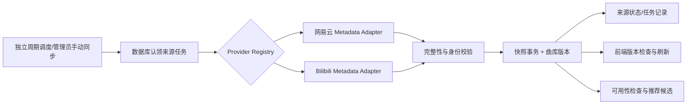

# 歌单自动同步与下一阶段功能方案

日期：2026-10-04。代码基线：`5b8a898`；业务数据基线：Bilibili 51 条、网易云 267 首，合计 318 条。本文是待实施方案，包含建议的接口和代码结构，不代表功能已启用。本轮只编写文档，不修改业务代码或服务器配置。

建议顺序：**双平台自动同步与音乐管理 → 推荐可用性和播放体验 → 拆分页面组件 → 布局设计改版**。先把数据状态、操作入口和组件边界稳定下来，设计阶段才能围绕明确的功能组织页面。

## 1. 当前已有能力与实际缺口

| 能力 | 当前实现 | 下一步 |
| --- | --- | --- |
| 曲库 | 两个平台已导入正式数据库，分页、搜索、来源状态均可用 | 自动跟随增删、排序、标题及作者变化 |
| 网易云同步 | 已有完整 ID 清单、详情补齐与结束复查；API 可手动触发 | 从每日推荐调度中解耦，按独立周期执行 |
| Bilibili 同步 | 前端脚本能读收藏夹并更新本地 JSON；正式库目前使用管理命令导入 | 新增后端 metadata Adapter，进入同一任务与快照流程 |
| 后台 | 博客修订、归档、分类标签、页内重登、静态发布状态已实现 | 增加音乐来源、同步记录和推荐管理页面 |
| 播放 | 跨页、暂停、切歌、服务端定位、错误重播已实现 | 补队列操作、播放模式、音量记忆和设备媒体控制 |
| 推荐 | 上海日期、历史 API、去重及同日幂等已实现 | 解决初始无候选导致当天始终为空，增加历史页面 |
| 收藏 | 浏览器本地收藏及快照兼容已实现 | 可选增加登录后的跨设备收藏 |
| 博客阅读 | 列表筛选、搜索、正文与 SEO 已实现 | 目录、上一篇/下一篇、首页最近文章；编辑器可加修订自动保存 |
| 运维 | Docker、HTTPS 内网入口、静态刷新和备份脚本已实现 | CI、日常备份安排、同步异常状态和资源监测 |

代码依据：

- [同步服务](../backend/internal/music/service.go)：`startSync` 和 `SyncDaily` 限制网易云；`execute` 超时 30 秒，`Recover` 根据运行超过 2 分钟回收；`ReplaceSnapshot` 已有事务、hash 去重及旧关系 inactive。
- [启动装配](../backend/cmd/api/main.go)：当前直接注入 `netease.New()`。
- [调度器](../backend/internal/platform/jobs.go)：来源同步与每日推荐耦合在上海时间 00:10 的流程中。
- [曲库加载](../frontend/src/useMusicLibrary.ts)、[分页客户端](../frontend/src/musicLibraryApi.ts)：已有取消和过期请求保护，尚无曲库版本轮询；分页检查总数与重复 ID，无法完整识别同总数下的替换和改名。
- [推荐服务](../backend/internal/recommendation/recommendation.go)：没有候选也写入当天记录，后续看到记录存在就不再生成。
- [音乐页](../frontend/src/views/MusicView.vue)：约 641 行，包含来源提示、搜索、收藏、背景选择和播放器展示；布局改版前适合拆分。

## 2. 优先级与本轮建议范围

| 优先级 | 项目 | 用户价值 | 建议 |
| --- | --- | --- | --- |
| P0 | 双平台独立自动同步 | 原歌单变化能自动进入网站 | 第一批实施 |
| P0 | 音乐管理入口与同步状态 | 不再依赖 SSH 导入，能看出何时更新、为何失败 | 与同步一起交付 |
| P0 | 前端曲库版本刷新 | 已打开页面也能收到新数据，避免混合分页 | 与同步一起交付 |
| P1 | 推荐候选检查、空结果补齐与历史 | 导入后能逐步形成可用推荐 | 第二批实施 |
| P1 | 队列、模式、音量记忆、Media Session | 改善每天实际听歌的体验 | 第二批实施 |
| P1 | 博客目录、相邻文章、首页最近文章 | 让博客更适合阅读与发现 | 布局前定义数据和位置 |
| P1 | 组件拆分、移动端和图片优化 | 降低后续改版成本 | 功能稳定后进行 |
| P2 | 账号收藏同步、编辑自动保存 | 多设备与长时间编辑更可靠 | 按使用频率决定 |
| P2 | 更完整的全文搜索、播放历史 | 内容规模增长后更有价值 | 有真实使用需求再做 |

已有的 SEO 自动发布、登录恢复、归档、分类标签和跨页播放器继续复用。评论、公开注册、社交关注、AI 推荐和微服务不列入近期交付，避免扩大维护范围。

## 3. 自动同步的用户行为

建议默认每 **30 分钟**检查一次，管理员可设为 5 分钟至 24 小时；前端可见时每 60 秒检查本站版本。当前 318 条规模使用整份元数据快照，先保证正确性。

| 原站操作/情况 | 网站行为 |
| --- | --- |
| 新增曲目 | 下一次成功同步后加入曲库 |
| 从歌单移除 | 当前来源关系设为 inactive；其他来源的同一曲目继续保留 |
| 改变顺序 | 按原站顺序更新当前来源的位置 |
| 改歌单名、歌曲名或作者 | 更新可确认的远端字段；管理员自定义显示名单独保存 |
| 变私密、登录限制、接口超时或分页异常 | 保留最后一次成功曲库，显示原因和最近成功时间 |
| 原歌单清空 | 完整确认空结果后更新；不把失败响应当空歌单 |
| 网站正在播放时同步完成 | 保持当前音频与队列，列表后台更新；重新选歌使用最新曲库 |
| 服务重启 | 补做已到期的来源，不重放所有历史调度，也不重复同一运行任务 |

在上游可访问、任务能在默认超时内完成的情况下，已打开页面的可见更新目标约为 30 分钟 + 一次同步耗时 + 1 分钟轮询。它是轮询同步，不承诺实时推送；后台应明确显示“最近检查”和“下次检查”。

## 4. 后端结构

首版继续使用现有 Go API 进程的生命周期与 PostgreSQL，不新增常驻微服务。把音乐同步调度和推荐调度拆开；多个 API 实例通过数据库认领避免重复执行。



建议代码组织（标注“新增”的路径目前不存在）：

| 文件 | 修改内容 |
| --- | --- |
| `backend/internal/music/provider/provider.go` | Adapter 返回包含来源信息、曲目及完整性证据的 Snapshot |
| `backend/internal/music/provider/registry.go`（新增） | 按 provider 路由，不把音频 Resolver 与元数据 Adapter 混在一起 |
| `backend/internal/music/provider/bilibili/playlist.go`（新增） | 收藏夹身份、分页、去重、失效项统计和复查 |
| `backend/internal/music/provider/netease/client.go` | 保留现有补齐逻辑，补充来源名称等可靠元信息 |
| `backend/internal/music/service.go` | 通用同步、认领、失败退避、过期任务回收、原子快照 |
| `backend/internal/platform/music_jobs.go`（新增） | 独立周期调度；原 `jobs.go` 保留推荐职责 |
| `backend/internal/platform/music_admin_http.go`（新增） | 音乐来源与任务管理，减少继续扩大 database_http.go |
| `backend/internal/music/import.go` | 本地导入也更新曲库版本并遵守统一锁顺序 |
| `backend/internal/music/playback_control.go`、`playback_store.go` | 公共可用性变化与曲库展示版本协调 |
| `backend/cmd/api/main.go` | 注册两个 Adapter，装配两个独立调度器 |
| `backend/cmd/manage/main.go` | 增加运维用 `sync-music <sourceId>`，避免一次性 helper |
| `api/openapi.yaml` | 更新来源、任务、版本和错误 DTO |

建议接口形状，具体实现时沿用当前 Track DTO：

```go
type Snapshot struct {
    RemoteTitle   *string
    OwnerID       string
    Tracks        []Track
    RemoteCount   int
    ObservedCount int
    SkippedCount  int
    EmptyConfirmed bool
}

type Adapter interface {
    FetchPlaylist(context.Context, Ref) (Snapshot, error)
}
```

Snapshot 中的计数必须来自已经验证的完整枚举。Adapter 测试需要证明 observed/remote/有效/失效项的对应关系；不能只靠设置一个布尔值跳过分页检查。封面可作为后续可选字段，缺失时保留默认图，不影响同步主流程。

### 4.1 Bilibili 收藏夹

迁移 [现有读取脚本](../frontend/scripts/sync-bilibili.mjs) 的业务规则到后端，并补强完整性：

1. 从白名单 URL 解析 ownerId/fid，核对响应的收藏夹 ID 与所有者；禁用任意上游 URL 和跳转。
2. 逐页读取，校验每页返回类型、total、has_more 和来源身份。限制响应体、页数与总条目，当前上限可沿用 2000。
3. 区分“源收藏总数”和“有效可导入视频数”。已失效、非视频条目必须有明确分类，不能因跳过它们错误地认定分页成功或丢页。
4. 默认保留现有 P1 规则及 `bilibili:<BVID>:1`，本轮不自动展开所有分 P，避免改变既有收藏 ID。
5. 完整读取后复查。没有可靠上游版本号时再读取一遍有序条目 ID；发现总数、身份或顺序变化就放弃该次提交，等待重试。
6. 网站接收到的是已确认完整的快照，失败不替换旧关系。

网易云保留完整 ID 清单、分批补详情和结束复查；返回元信息时不能用缺失字段覆盖已有名称。两个平台使用的是现有网页公开元数据链路，不能把它们当成具有稳定 SLA 的开放接口。

### 4.2 调度与失败处理

- API 每 15 秒查找到期来源；实际抓取间隔默认 30 分钟，并加入少量 jitter，避免同时重启时集中请求。
- 认领阶段使用短事务和 `FOR UPDATE SKIP LOCKED`，持久化 runId、租约截止时间和 token，随后释放事务再请求网络。该机制适用于任务认领，不用于公开曲库读取。[PostgreSQL SELECT](https://www.postgresql.org/docs/17/sql-select.html)
- 同来源最多一个 running；本实例默认全局两个同步任务，并限制每平台请求速率。未来多实例扩大吞吐时再补数据库级平台配额。
- 默认单任务 90 秒，可配置至 5 分钟；条目上限是校验上限，不保证慢上游的大歌单都能在默认超时内完成。
- 回收依据明确的 lease_expires_at，不继续硬编码“运行超过 2 分钟”。提交与失败写回都检查 runId/token，旧 worker 不能覆盖新任务。
- 短暂失败建议 5 分钟、15 分钟、1 小时、6 小时退避，成功后恢复正常周期；尊重可靠的 Retry-After，手动按钮也不能绕过冷却与并发限制。
- 自动任务失败只更新任务、错误码和下次时间，保留数据；私密/无权限不无限重试或自动借用账号 Cookie。
- 关闭自动同步保留曲库；停用整个来源则隐藏它并取消其待提交结果。取消不计为上游失败。
- 退出时停止接单、取消网络请求并落终态；异常退出由租约回收。

“上游返回空歌单”是高影响变化：从非空变空时，要求来源身份完整、明确的零总数及结束标志，并在至少一分钟后复核相同结果。若接口无法给出可靠证据，保留旧数据并提示管理员核验。首次检查以独立 outcome 表达“待确认”，结束当前任务，将 next_sync_at 调整为一分钟后；不占用 worker 原地等待，也不冒充同步失败。

## 5. 数据库与一致性

建议新增迁移 `000007_music_sync_jobs.up.sql`，实施前重新确认下一个可用编号。保留当前表及历史记录；已有 `netease_sync_runs` 已承载两种来源的导入，本轮沿用表名，避免无业务收益的重命名。

| 表 | 建议增加 |
| --- | --- |
| `music_sources` | config_version（默认 1，仅配置变更递增）、auto_sync_enabled（默认 false）、sync_interval_seconds（默认 1800）、next_sync_at、last_checked_at、last_changed_at、consecutive_failures、remote_title、display_name、owner_external_id；空结果确认的 hash/时间 |
| `netease_sync_runs` | trigger_kind、lease_token、lease_expires_at、outcome、added_count、removed_count、updated_count、source_count、skipped_count |
| `music_library_state`（新增） | 单行 revision bigint，初始为 1；对外用字符串 |

索引建议：启用自动同步来源的 next_sync_at 部分索引；`source_id, started_at DESC` 任务查询索引；同来源 running 任务的唯一部分索引。迁移前先检查旧 running 异常记录，不能为建立索引静默删除它们。

### 5.1 快照提交规则

在一个事务中更新曲目元数据、当前来源关系/顺序、来源名称、变更统计、任务终态及全局曲库版本。内容未变化时只更新检查时间与任务结果，不刷曲库版本，不全量重写条目。

继续使用 inactive 表达来源移除，不物理删除 music_items、其他来源关联、收藏或历史推荐。保留已经实际验证的公共播放状态；元数据 unknown 不能覆盖一次可靠的可用性结果，也不能把私人账号结果变为公共可用。

曲库版本覆盖所有公开展示变更，包括导入、自动同步、来源启停/显示名以及公共 availability 改变；仅播放检查时间、运行日志或同步心跳改变时不递增。共用曲目被另一歌单更新也必须使版本变化，不能只更新当前 source 的版本。

统一写锁顺序：曲库版本行 → 来源行（多个来源按 ID 排序）→ 曲目/关系。现有 Import 先锁来源再调用 ReplaceSnapshot 的嵌套流程需要一起调整；任务认领只改任务状态，不再反向获取曲库版本锁。网络请求不持有这些锁。

### 5.2 防止同步时读到混合分页

公开列表返回 libraryVersion；新前端携带该版本读取全部分页。每个请求在一个只读 Repeatable Read 事务内读取版本、total 和数据，所有查询使用同一 tx。版本不匹配返回 409 `MUSIC_LIBRARY_CHANGED`，整批前端加载重试。

Read Committed 下，同一事务内的两个查询也可能看到不同提交；Repeatable Read 提供请求内稳定视图。跨 HTTP 页的一致性仍由版本参数负责。[PostgreSQL 17 隔离级别](https://www.postgresql.org/docs/17/transaction-iso.html)

```json
{
  "data": [{ "id": "bilibili:3549762089", "trackCount": 51 }],
  "libraryVersion": "12"
}
```

对应分页请求：`GET /api/v1/music/playlists/{id}/tracks?page=1&pageSize=50&libraryVersion=12`。

新增字段保持兼容，旧客户端未传版本时仍可读取一致的单页；新客户端必须传版本。首版保留现有 page/pageSize，上限 50；当前规模先不引入游标和虚拟列表。

## 6. 管理 API 与页面

以下路径均以 `/api/v1` 为前缀，新增内容需要同步 OpenAPI、权限与错误测试。

| 方法与路径 | 行为 |
| --- | --- |
| `GET /admin/music/playlists`（新增） | 含停用来源、自动开关、检查/变化/下次时间、冷却和当前 runId |
| `POST /admin/music/playlists`（新增） | 解析受支持 URL，建立规范化 provider/externalId；重复来源返回 409 |
| `PATCH /admin/music/playlists/{id}`（新增） | 更新显示名、启停、自动同步和间隔；需 version 防止并发覆盖 |
| `POST /admin/music/playlists/{id}/sync`（已有，扩展） | 两个平台都可触发，返回 202/runId；重复 running 返回 409 并附已有 runId |
| `GET /admin/music/sync-runs/{id}`（已有） | 返回终态、错误码和增删改统计 |
| `GET /admin/music/sync-runs?sourceId=...&page=...`（新增） | 分页任务历史，限制 pageSize |
| `GET /music/playlists`（扩展） | public 状态、最近成功时间与 libraryVersion；不暴露内部诊断或凭据 |

复用现有管理员会话、CSRF、Origin 和限流。更换为另一歌单 URL 应新建来源，再由管理员停用旧来源，不能修改旧 source ID 的含义。

新增 `frontend/src/views/AdminMusicView.vue`、`musicAdminApi.ts`，页面包括来源表、自动同步开关、立即同步、最近记录和失败重试。同步按钮只等待任务接收，随后轮询 runId，不能阻塞页面到上游请求结束。游客只看到简洁的更新时间和保留旧曲库提示。

## 7. 前端自动跟随

修改 `useMusicLibrary.ts` 与 `musicLibraryApi.ts`：

1. 初次打开按现有流程加载；可见时每 60 秒读取轻量来源信息，回到页面时立即检查。
2. 使用 Page Visibility API 暂停隐藏页面轮询；通过递归 setTimeout 在请求结束后安排下一次，不叠加请求。[Page Visibility API](https://developer.mozilla.org/en-US/docs/Web/API/Page_Visibility_API)
3. 版本相同只更新来源状态；版本变化才拉新曲目，在临时数组中完成全量校验后一次替换。
4. 409 最多立即重试一次，仍变化则保留旧数据并稍后重试。网络错误保留旧曲库，区分首次 loading 与后台 refreshing。
5. 继续使用 AbortController/generation，离开页面取消；保留搜索词、平台筛选、收藏和合理的滚动位置。
6. 刷新曲库不调用 player.stop，不创建第二个 Audio，不替换正在播放的队列。移除项在收藏/旧推荐中保留提示与原站入口，新播放请求由后端重新判断。

首版可见更新展示轻量提示“曲库已更新”，不要在每次无变化检查时打断用户。

## 8. 推荐为什么也要一起优化

当前 318 条初始 availability 都是 unknown，推荐只选经过公共可用性检查的 available 曲目；已经保存的空推荐也不会自动补齐。因此只增加同步仍可能让“发现”页长期为空。

建议第二批同时解决两个问题：

- **候选检查**：复用现有公开播放解析、策略和校验管道，对少量新增/过期候选做有界检查。默认并发 1、每轮最多 5 首、每首最多 15 秒/512 KiB，播放繁忙时延后；共用解析、转码和流量配额。仅在既有有效音频检查成功后记为公共 available，不靠元数据或仅返回 URL 判定。试听不参选，unknown 完整性不升级为 full，音频不落盘。
- **未发布推荐等待候选**：新增 waiting_candidates/ready 状态与 published_at。没有候选时等待；出现合格候选后生成当天第一份非空结果。非空结果一旦发布就保持固定。旧历史日期不改；当前遗留的 ready 空结果仅允许管理员显式补齐，并记录原因和操作，不删除记录重抽。

候选检查新鲜度建议 24 小时，首次可调；这是推荐置信度和后台探测频率，不保证来源永久可播。推荐页在候选不足时显示原因并给出“进入音乐库”入口。

候选按来源轮流选择，优先从未检查的条目；失败条目按错误类型设置下次检查时间，不能一直重试前五首。建议每小时最多检查 20 首，站长可指定优先样本，用户正常播放的成功结果也能直接成为候选。同步本身只读取元数据，不默认对整张歌单下载或探测音频。

建议新增管理员 `POST /admin/music/recommendations/today/fill-empty`，服务端只允许当天、当前零项且存在合格候选的情况，仍使用现有日期事务锁。历史页复用已有日期查询 API，先支持最近 30 天。迁移可独立为 `000008_recommendation_readiness.up.sql`，避免与同步一次性上线。

## 9. 其他功能与布局前准备

### 9.1 播放体验（P1）

在现有 App 级播放器中增加队列查看、移出队列、下一首播放、顺序/列表循环/单曲循环/随机模式；默认保留顺序播放。试听结束继续停止并显示提示，播放模式不能覆盖此约束。错误不无限跳歌。

音量和播放模式可保存在 localStorage；播放进度仅作可恢复位置提示，刷新后由用户点击继续，不强制自动出声。进度定位仍是新会话，会消耗现有创建配额，拖动只在松开时提交。

可增加 Media Session 支持锁屏/系统播放控制，按浏览器能力检测逐项注册，不支持时保留页面按钮。[Media Session API](https://developer.mozilla.org/en-US/docs/Web/API/Media_Session_API)

### 9.2 账号收藏（P2，可选）

访客继续本地收藏；登录后可明确选择把本机收藏合并到账号。新增 user_music_favorites，唯一键 user_id/item_id；服务端从会话确定用户，不接收任意 userId。API 使用 `/me/music/favorites`，写操作复用 CSRF。

保留不可用收藏的标题快照与原站入口，不因来源同步移除而删除用户收藏。退出后切回访客数据，避免不同账号共用一份缓存。无需为这个功能同时开放公开注册。

### 9.3 博客功能（P1/P2）

- 文章目录、阅读进度、上一篇/下一篇：先定义数据与锚点，目录 ID 必须由共享 Markdown renderer 稳定生成，客户端与 SEO HTML 一致，继续关闭任意 HTML。
- 首页最近文章和音乐入口：从真实 API 取少量数据，具备 loading/empty/error 状态，为后续布局准备真实内容。
- 自动保存修订草稿：仅在已认证且内容有变时防抖保存；保存不自动发布。遇到 409 停止自动保存并保留输入，登录过期沿用现有页内重登与导出。先作为可关闭选项。
- 全文搜索等内容规模增长后再做，当前 title/summary 搜索继续保留，避免提前增加中文分词和索引维护成本。

### 9.4 组件与性能

建议将 MusicView 拆成 `MusicSidebar`、`MusicLibraryPanel`、`PlaylistStatus`、`TrackList`、`PlayerPanel`；音乐管理独立页面。同步状态、收藏和筛选放入 composable，组件只接收 props 并发出用户动作。App 中的播放器 provider 保持唯一。

为布局准备桌面/手机两套排版约束：播放器不遮挡列表，长标题可读，键盘焦点可见，空态和错误态占位稳定。后续设计再确定视觉方向与首页重点，本阶段只稳定插槽、状态与交互。

优先压缩当前约 2.8–3 MB 的背景图，提供移动尺寸与现代格式，非当前背景按需加载；路由按需加载、尊重 reduced-motion。性能目标通过真机测量确定，先不为 318 条曲目引入复杂虚拟列表。

## 10. 配置、部署和回退

建议配置：`MUSIC_SYNC_ENABLED=false`、默认间隔 30m、任务超时 90s、并发 2。迁移和新代码部署完成后再为这两个来源启用。旧 `MUSIC_AUTO_SYNC` 在兼容期映射到新调度器，删除 jobs.go 中重复同步调用，不能同时保留两套自动触发。

沿用当前 Docker API 进程，无须新建定时容器；新增调度在 API 启动时装配。先备份、执行新增迁移、部署后端，再部署兼容新 DTO 的前端，最后开启来源自动同步并核对首轮。正式页面按现有 SEO 发布流程生成，音乐数据更新本身通过 API 生效，不触发整站静态重建。

回退时先关闭自动同步，取消/等待任务终态，保留已成功的曲库。优先关闭功能开关；如需旧二进制，先确认旧版本不会重新运行旧每日同步逻辑。新增字段保留，不靠 DROP 或 force migration 回退。

运维补齐：管理员显示最近成功时间、连续失败次数和下次重试；CI 执行真实 PostgreSQL 集成，明确识别 SKIP。容器日志继续主机默认 3×10 MB 轮转。测试在专用库/唯一临时目录执行，完成后清理已确认无用产物；权限不足或文件锁定时跳过，不提权强删。生产数据、当前发布及有效备份不进入清理名单。

## 11. 验收清单

| 场景 | 通过标准 |
| --- | --- |
| 两来源正常同步 | 使用 fixtures 验证增删改/排序，再只读实测用户现有来源；网站最终与成功快照一致 |
| 私密、403、429、HTML、超时、分页缺失 | 旧曲库不变，错误分类、退避与最近成功时间正确 |
| 空歌单 | 可靠身份与空结果复核后才清空当前关系，不删除历史和其他来源 |
| 同时手动/自动、两实例启动 | 同来源只有一个 running；旧租约任务不能提交；重启能恢复到期任务 |
| 相同数量的替换/改名 | 库版本变化，分页不混合，新前端能刷新 |
| 曲目属于多个来源 | 一个来源移除不影响另一个；共用元数据更新能触发库版本变化 |
| 刷新与播放并发 | 音频、暂停状态、音量和当前队列保持，过期请求不能覆盖新结果 |
| 推荐初始空结果 | 不伪造 available；等待候选或显式补齐一次，非空日推荐保持固定 |
| 管理权限 | 未登录 401、普通用户 403、写请求 CSRF/Origin、限流与冲突正确 |
| 浏览器与设备 | 真实浏览器验证加载/刷新/失效/回到页面，手机与桌面各一轮；音频需人工听验 |
| 部署兼容 | 当前迁移数据与已有 318 条、收藏 ID、管理员账号保留；关闭开关可停止新调度 |

前端统一 pnpm：现有 `test:music`、`test:blog`、`test:seo`、type-check 继续通过，再补同步管理和版本刷新用例。后端覆盖 Adapter、调度时钟、数据库并发与租约；真实上游只做有限抽样，不把每次 CI 都变成平台接口爬取。

## 12. 建议交付批次

| 批次 | 交付内容 | 粗略工作量 |
| --- | --- | --- |
| A | Snapshot/Registry、Bilibili Adapter、迁移、调度、后端 API 与并发测试 | 3–5 个开发日 |
| B | 音乐管理、前端版本刷新、错误与空态、部署验收 | 2–3 个开发日 |
| C | 推荐候选检查/空结果补齐/历史、队列与基础播放偏好 | 3–5 个开发日 |
| D | 组件拆分、阅读功能、资源优化，再进入视觉布局改版 | 2–4 个开发日，视觉设计另估 |

这是按当前单人个人站规模给出的工作量估算，实际取决于上游响应稳定性和设计修改次数。账号云收藏与全文搜索单独排期。

第一阶段完成标准：两条真实来源能自动跟随，管理员能看懂同步状态，正在播放时刷新无干扰，数据失败不会被清空。达到这一步即可开始布局设计，不必等所有 P2 功能完成。
